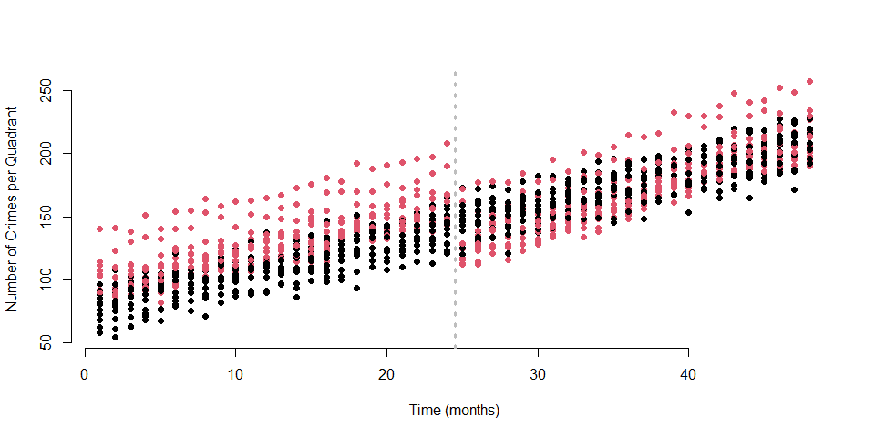
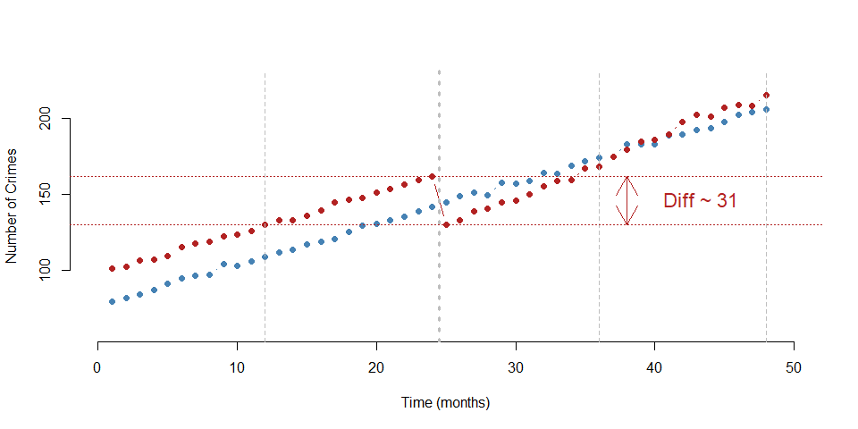
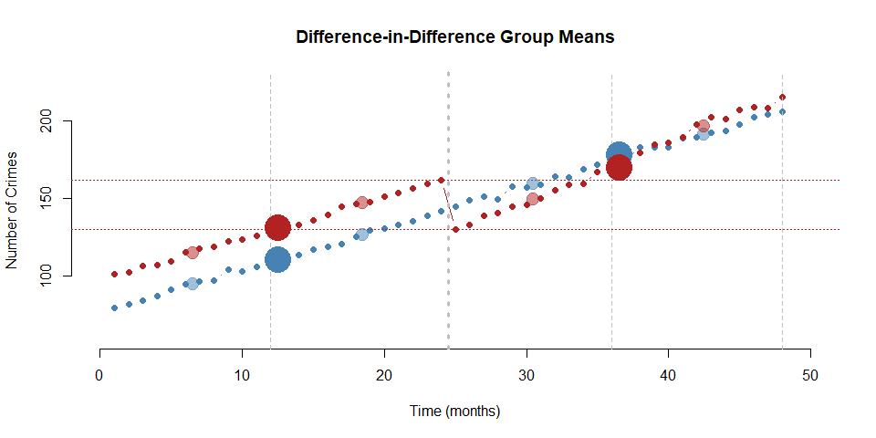
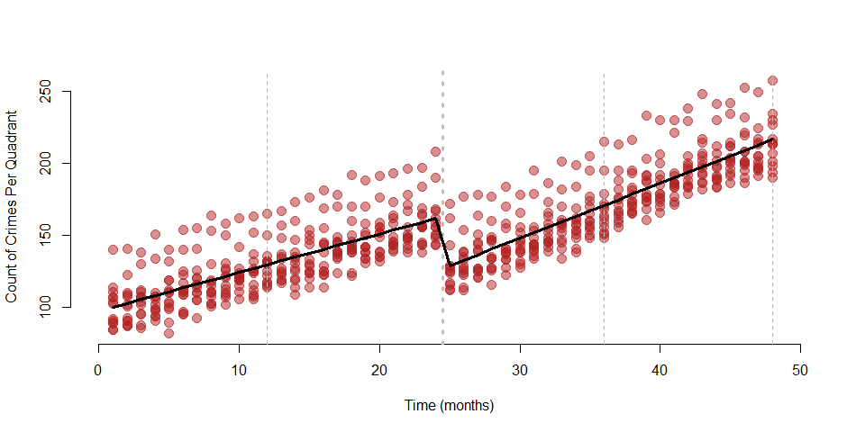
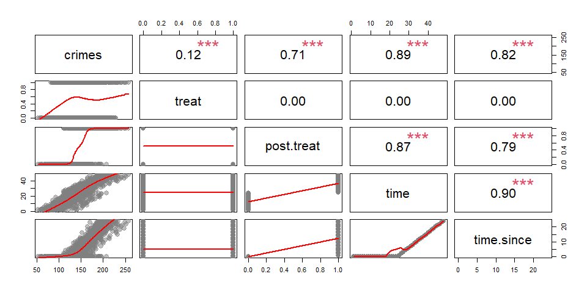
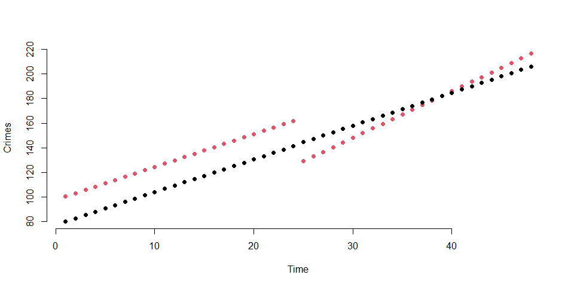

Difference in Difference Lab
================

- [Instructions](#instructions)
  - [The policy problem](#the-policy-problem)
- [Lab Questions](#lab-questions)
  - [Question 1](#question-1)
  - [Question 2](#question-2)
  - [Question 3](#question-3)
  - [Question 4](#question-4)
  - [BONUS QUESTIONS](#bonus-questions)
  - [CHALLENGE QUESTION](#challenge-question)
  - [Answer:CHALLENGE QUESTION](#answerchallenge-question)
- [Submission Instructions](#submission-instructions)

# Instructions

There are **4 sets of questions**. You can earn up to 100 points + bonus
questions. Points are indicated next to each question.

Remember to:

- Format your table using stargazer
- Submit the r markdown file with all your codes.
- Bold your answers.

## The policy problem

This lab is loosely based on Branas et al. (2011) article, entitled [“A
Difference-in-Differences Analysis of Health, Safety, and Greening
Vacant Urban
Space”](https://academic.oup.com/aje/article/174/11/1296/111352).

The ‘broken windows’ theory suggests that “vacant lots offer refuge to
criminal and other illegal activity and visibly symbolize that a
neighborhood has deteriorated, that no one is in control, and that
unsafe or criminal behavior is welcome to proceed with little if any
supervision” (p. 1297).

To prevent these problems, city A has decided to implement a public
program that will green some of the city’s vacant lots in 4 different
neighborhoods. ‘Greening’ includes removing trash and debris and
planting grass and trees to create a park.

Simulated data on vandalism acts include the total number of calls about
vandalism acts that the police has received during the year before and
after the greening from households near the vacant lots.

> **Research question**: Does greening vacant lots decreases vandalism
> in City A?

Three years after its implementation, the city wants to know whether the
program has been successful and propose to compare lots that have been
‘greened’ and lots that are still vacants within the same neighborhoods
but could have been chosen for greening.

> **Hypothesis**: Greening vacant lots will decrease vandalism in City
> A. \## Data

Data on vandalism acts were reported by the local police and include the
total number of calls about vandalism acts that the police has received
during the year before and after the greening from households near the
vacant lots.

``` r
URL <- "https://raw.githubusercontent.com/DS4PS/pe4ps-textbook/master/labs/DATA/diff-in-diff-lab.csv"
data <- read.csv( URL, stringsAsFactors=F )
head( data ) %>% pander()
```

|  X  | Vandalism | Months | Group | Post |
|:---:|:---------:|:------:|:-----:|:----:|
|  1  |   1777    |   0    |   1   |  0   |
|  2  |   2079    |   0    |   1   |  0   |
|  3  |   2432    |   0    |   0   |  0   |
|  4  |   2271    |   0    |   0   |  0   |
|  5  |   2726    |   0    |   1   |  0   |
|  6  |   2866    |   10   |   0   |  1   |

| **Variable name** | **Description **                                                                           |
|-------------------|--------------------------------------------------------------------------------------------|
| Vandalism         | Number of calls about vandalism acts near to the vacant lots                               |
| Group             | Treatment (=1) and control group (=0)                                                      |
| Post_Treatment    | Observation three years before the treatment (=0) and three years after the treatment (=1) |

# Lab Questions

## Question 1

**Q1: Write down the difference-in-difference model** (5 points)

**Answer: Question 1**

$$\begin{equation} 
\text{Vandalism} = \beta_0 + \beta_1*Treatment + \beta_2*\text{Post_Treatment} + \beta_3 * Treatment * \text{Post_Treatment}+ \text{e}
\end{equation}$$

## Question 2

**Q2: Run the regression in R and present results in a nice table with
stargazer** (5 + 5 points)

``` r
m1<-lm(Vandalism~Group+Post+Group:Post, data = data)


stargazer( m1, 
           type= "html", digits=3,
           intercept.bottom = FALSE,
           omit.stat = c("ser","f","rsq","adj.rsq") )
```

<table style="text-align:center">
<tr>
<td colspan="2" style="border-bottom: 1px solid black">
</td>
</tr>
<tr>
<td style="text-align:left">
</td>
<td>
<em>Dependent variable:</em>
</td>
</tr>
<tr>
<td>
</td>
<td colspan="1" style="border-bottom: 1px solid black">
</td>
</tr>
<tr>
<td style="text-align:left">
</td>
<td>
Vandalism
</td>
</tr>
<tr>
<td colspan="2" style="border-bottom: 1px solid black">
</td>
</tr>
<tr>
<td style="text-align:left">
Constant
</td>
<td>
2,240.901<sup>\*\*\*</sup>
</td>
</tr>
<tr>
<td style="text-align:left">
</td>
<td>
(14.806)
</td>
</tr>
<tr>
<td style="text-align:left">
</td>
<td>
</td>
</tr>
<tr>
<td style="text-align:left">
Group
</td>
<td>
26.258
</td>
</tr>
<tr>
<td style="text-align:left">
</td>
<td>
(21.417)
</td>
</tr>
<tr>
<td style="text-align:left">
</td>
<td>
</td>
</tr>
<tr>
<td style="text-align:left">
Post
</td>
<td>
318.085<sup>\*\*\*</sup>
</td>
</tr>
<tr>
<td style="text-align:left">
</td>
<td>
(21.121)
</td>
</tr>
<tr>
<td style="text-align:left">
</td>
<td>
</td>
</tr>
<tr>
<td style="text-align:left">
Group:Post
</td>
<td>
-953.104<sup>\*\*\*</sup>
</td>
</tr>
<tr>
<td style="text-align:left">
</td>
<td>
(30.174)
</td>
</tr>
<tr>
<td style="text-align:left">
</td>
<td>
</td>
</tr>
<tr>
<td colspan="2" style="border-bottom: 1px solid black">
</td>
</tr>
<tr>
<td style="text-align:left">
Observations
</td>
<td>
1,369
</td>
</tr>
<tr>
<td colspan="2" style="border-bottom: 1px solid black">
</td>
</tr>
<tr>
<td style="text-align:left">
<em>Note:</em>
</td>
<td style="text-align:right">
<sup>*</sup>p\<0.1; <sup>**</sup>p\<0.05; <sup>***</sup>p\<0.01
</td>
</tr>
</table>

  
  

- **Q2a:** What is the average number of calls about vandalism acts in
  the control group before the treatment? (5 points)

- **Answer:Q2a**

The average number of calls regarding vandalism acts in the control
group is ~2241 before the treatment.

- **Q2b:** Did the number of calls for vandalism in the treatment and
  control groups differ significantly before the treatment? Which
  coefficient provides you this information? (5 + 5 points)

- **Answer:Q2b**

Coefficient B1 represents the difference between the control and
treatment groups in the pre-treatment period. From the output, this is
Not statistically significant. On average, there is no difference
between the two groups in the pre-treatment period.

- **Q2c:** Do treatment and control groups need to be identical in the
  pre-treatment period for valid inference? (10 points)

- **Answer:Q2c**

No. They need to have similar pre-treatment trends for valid inference.
Based on the parallel trends assumption( pre-trends testing), a control
group that’s similar to the treatment group makes this assumption more
plausible.

- **Q2d:** Does the number of calls in the control group change after
  the intervention? Specify if it increases or decreases. (5 points)

- **Answer: Q2d:**

The coefficient B2 is significant and positive. This shows an increase
of the calls in the post treatment period for the control group.

- **Q2e:** What is the average number of calls in the control group
  after the intervention? (5 points)

- **Answer: Q2e:**

The average number of call for the control group in the post treatment
period is **~2559**

- **Q2f:** Does greening help to reduce vandalism? Report the
  coefficient that you need to look. (5 + 5 points)

- **Answer: Q2f:**

The coefficient B3 is significant and positive. This states the
differential effect in regards to the treatment **greening**. Greening
is shown to have a negative impact on vandalism.

- **Q2g:** What is the average number of calls in the treatment group
  after the intervention? (5 points)

- **Answer: Q2g:**

The average number of calls for the treatment group in the post
treatment period is **~1632**

## Question 3

**Q3: Let’s now look at the counterfactual.**

- **Q3a:** Write the counterfactual formula. (5 points)

- **Answer: Q3a:**

  

$$\begin{equation} 
\text{Counterfactual} = \beta_0 + \beta_1 + \beta_2
\end{equation}$$

  

- **Q3b:** Calculate the counterfactual, i.e., how many calls for
  vandalism acts we would expect, had the intervention not occured. (5
  points)

- **Answer: Q3b:**

The counterfactual calculation is **~2585**

We would expect this amount of calls for vandalism for the treatment
group had the treatment not occurred.

- **Q3c:** What is the main assumption behind the counterfactual? (5
  points)

- **Answer: Q3c:**

The main assumption behind the counterfactual is the representation of
the treatment group had the treatment group not occurred. This is called
the Parallel Trend Assumption.

The two groups would have trended in a similar pattern before treatment.

## Question 4

Let’s consider the same study design but now let’s compare two different
approaches to analyzing the data.

We will use a slightly different dataset, one that contains the monthly
number of vandalism crimes that the police has received in the four
study neighborhoods over a four-year period.

``` r
URL <- "https://raw.githubusercontent.com/DS4PS/pe4ps-textbook/master/labs/DATA/time-series-diff-n-diff-comparison.csv"
dat <- read.csv( URL, stringsAsFactors=F )
rbind( head(dat), tail(dat) ) %>% pander()
```

|          | nhood | quadrant |  group  | month | year | time | treat |
|:--------:|:-----:|:--------:|:-------:|:-----:|:----:|:----:|:-----:|
|  **1**   | NH-01 |   Q-A    |  treat  |   1   | 1994 |  1   |   1   |
|  **2**   | NH-01 |   Q-B    | control |   1   | 1994 |  1   |   0   |
|  **3**   | NH-01 |   Q-C    |  treat  |   1   | 1994 |  1   |   1   |
|  **4**   | NH-01 |   Q-D    | control |   1   | 1994 |  1   |   0   |
|  **5**   | NH-01 |   Q-E    |  treat  |   1   | 1994 |  1   |   1   |
|  **6**   | NH-01 |   Q-F    | control |   1   | 1994 |  1   |   0   |
| **1243** | NH-04 |   Q-U    |  treat  |  12   | 1997 |  48  |   1   |
| **1244** | NH-04 |   Q-V    | control |  12   | 1997 |  48  |   0   |
| **1245** | NH-04 |   Q-W    |  treat  |  12   | 1997 |  48  |   1   |
| **1246** | NH-04 |   Q-X    | control |  12   | 1997 |  48  |   0   |
| **1247** | NH-04 |   Q-Y    |  treat  |  12   | 1997 |  48  |   1   |
| **1248** | NH-04 |   Q-Z    | control |  12   | 1997 |  48  |   0   |

Table continues below

|          | post.treat | time.since | crimes | treat.x.post |
|:--------:|:----------:|:----------:|:------:|:------------:|
|  **1**   |     0      |     0      |  107   |      0       |
|  **2**   |     0      |     0      |   96   |      0       |
|  **3**   |     0      |     0      |   92   |      0       |
|  **4**   |     0      |     0      |   72   |      0       |
|  **5**   |     0      |     0      |   89   |      0       |
|  **6**   |     0      |     0      |   91   |      0       |
| **1243** |     1      |     24     |  257   |      1       |
| **1244** |     1      |     24     |  208   |      0       |
| **1245** |     1      |     24     |  190   |      1       |
| **1246** |     1      |     24     |  192   |      0       |
| **1247** |     1      |     24     |  214   |      1       |
| **1248** |     1      |     24     |  196   |      0       |

We have 48 months of data, and the vacant lot clean-up occurred between
the 24th and 25th months. The mayor asks an analyst to evaluate the
impact of the intervention.

Here is what our data looks like with red points representing the
treatment group and blue representing the control:

``` r
dat$group <- factor( dat$group )
plot( dat$time, dat$crime, pch=19, col=dat$group, bty="n",
      xlab="Time (months)", ylab="Number of Crimes per Quadrant" )
abline( v=24.5, lty=3, col="gray", lwd=3 )
```

<!-- -->

We can simplify the graph by calculating the average crime rate across
all quadrants in the study within each time period:

``` r
ts1 <- 
  dat %>% 
  filter( group == "control" ) %>%
  group_by( time ) %>% 
  summarize( ave=mean( crimes ) )
ts2 <- 
  dat %>% 
  filter( group == "treat" ) %>%
  group_by( time ) %>% 
  summarize( ave=mean( crimes ) )
y.24 <- ts2$ave[24]
y.25 <- ts2$ave[25]
diff <- y.24 - y.25 
plot( ts1$time, ts1$ave, type="b", pch=19, col="steelblue", bty="n",
      xlab="Time (months)", ylab="Number of Crimes", 
      xlim=c(0,50), ylim=c(60,225) )
points( ts2$time, ts2$ave, type="b", pch=19, col="firebrick" ) 
abline( v=c(12,36,48), lty=2, col="gray" )
abline( v=24.5, lty=3, col="gray", lwd=3 )
abline( h=c(y.24,y.25), lty=3, col="firebrick" )
arrows( x0=38, y0=y.24, y1=y.25, col="firebrick", code=3 )
text( x=40, y=mean(c(y.24,y.25)), 
      paste0( "Diff ~ ", round(diff,0) ), 
      col="firebrick", pos=4, cex=1.4 )
```

<!-- -->

Note that there appears to be an immediate impact of the program, but
over time we also observe what appears to be a regression to the mean
level of vandalism in the treatment quadrants.

To estimate program impact the analyst runs the follow two models:

**Diff-in-Diff**

$$
\text{crimes} = a_0 + a_1 \cdot treat + a_2 \cdot post + a_3 \cdot treat.post  + e
$$

``` r
m1 <- lm( crimes ~ treat + post.treat + treat.x.post, data=dat )
stargazer( m1, type="html", digits=2,
           omit.stat=c("f","rsq","adj.rsq","ser"),
           intercept.bottom = FALSE,
           covariate.labels = c("Intercept (a0)", 
                                "Treatment Group (a1)",
                                "Post-Treatment Period (a2)", 
                                "Treat x Post (a3)" ) )
```

<table style="text-align:center">
<tr>
<td colspan="2" style="border-bottom: 1px solid black">
</td>
</tr>
<tr>
<td style="text-align:left">
</td>
<td>
<em>Dependent variable:</em>
</td>
</tr>
<tr>
<td>
</td>
<td colspan="1" style="border-bottom: 1px solid black">
</td>
</tr>
<tr>
<td style="text-align:left">
</td>
<td>
crimes
</td>
</tr>
<tr>
<td colspan="2" style="border-bottom: 1px solid black">
</td>
</tr>
<tr>
<td style="text-align:left">
Intercept (a0)
</td>
<td>
110.53<sup>\*\*\*</sup>
</td>
</tr>
<tr>
<td style="text-align:left">
</td>
<td>
(1.43)
</td>
</tr>
<tr>
<td style="text-align:left">
</td>
<td>
</td>
</tr>
<tr>
<td style="text-align:left">
Treatment Group (a1)
</td>
<td>
20.51<sup>\*\*\*</sup>
</td>
</tr>
<tr>
<td style="text-align:left">
</td>
<td>
(2.03)
</td>
</tr>
<tr>
<td style="text-align:left">
</td>
<td>
</td>
</tr>
<tr>
<td style="text-align:left">
Post-Treatment Period (a2)
</td>
<td>
64.85<sup>\*\*\*</sup>
</td>
</tr>
<tr>
<td style="text-align:left">
</td>
<td>
(2.03)
</td>
</tr>
<tr>
<td style="text-align:left">
</td>
<td>
</td>
</tr>
<tr>
<td style="text-align:left">
Treat x Post (a3)
</td>
<td>
-23.09<sup>\*\*\*</sup>
</td>
</tr>
<tr>
<td style="text-align:left">
</td>
<td>
(2.87)
</td>
</tr>
<tr>
<td style="text-align:left">
</td>
<td>
</td>
</tr>
<tr>
<td colspan="2" style="border-bottom: 1px solid black">
</td>
</tr>
<tr>
<td style="text-align:left">
Observations
</td>
<td>
1,248
</td>
</tr>
<tr>
<td colspan="2" style="border-bottom: 1px solid black">
</td>
</tr>
<tr>
<td style="text-align:left">
<em>Note:</em>
</td>
<td style="text-align:right">
<sup>*</sup>p\<0.1; <sup>**</sup>p\<0.05; <sup>***</sup>p\<0.01
</td>
</tr>
</table>

  
  

``` r
C1 <- mean( dat$crimes[ dat$year == 1994 & dat$group == "control" ] )
C2 <- mean( dat$crimes[ dat$year == 1995 & dat$group == "control" ] )
C3 <- mean( dat$crimes[ dat$year == 1996 & dat$group == "control" ] )
C4 <- mean( dat$crimes[ dat$year == 1997 & dat$group == "control" ] )
T1 <- mean( dat$crimes[ dat$year == 1994 & dat$group == "treat" ] )
T2 <- mean( dat$crimes[ dat$year == 1995 & dat$group == "treat" ] )
T3 <- mean( dat$crimes[ dat$year == 1996 & dat$group == "treat" ] )
T4 <- mean( dat$crimes[ dat$year == 1997 & dat$group == "treat" ] )
dd.C1 <- mean( dat$crimes[ dat$post == 0 & dat$group == "control" ] )
dd.C2 <- mean( dat$crimes[ dat$post == 1 & dat$group == "control" ] )
dd.T1 <- mean( dat$crimes[ dat$post == 0 & dat$group == "treat" ] )
dd.T2 <- mean( dat$crimes[ dat$post == 1 & dat$group == "treat" ] )
plot( ts1$time, ts1$ave, type="b", pch=19, col="steelblue", bty="n",
      xlab="Time (months)", ylab="Number of Crimes", 
      main="Difference-in-Difference Group Means",
      xlim=c(0,50), ylim=c(60,225) )
points( ts2$time, ts2$ave, type="b", pch=19, col="firebrick" ) 
abline( v=c(12,36,48), lty=2, col="gray" )
abline( v=24.5, lty=3, col="gray", lwd=3 )
abline( h=c(y.24,y.25), lty=3, col="firebrick" )
points( c(6.5,18.5,30.5,42.5), c(C1,C2,C3,C4), 
        pch=19, col=adjustcolor("steelblue",alpha=0.5), cex=2 )
points( c(6.5,18.5,30.5,42.5), c(T1,T2,T3,T4), 
        pch=19, col=adjustcolor("firebrick",alpha=0.5), cex=2 )
points( c(12.5,36.5), c(dd.C1,dd.C2+3), col="steelblue", pch=19, cex=4 )
points( c(12.5,36.5), c(dd.T1,dd.T2-3), col="firebrick", pch=19, cex=4 )
```

<!-- -->

**Interrupted Time Series**

$$
\text{crimes} = b_0 + b_1 \cdot time + b_2 \cdot post + b_3 \cdot time.since  + e
$$

Note we only need the treatment group for this model since it is a
reflexive design:

``` r
d2 <- filter( dat, group == "treat" )
 
m2 <- lm( crimes ~ time + post.treat + time.since, data=d2 )
plot( d2$time, d2$crimes, pch=19, 
      col=adjustcolor("firebrick",alph=0.5), cex=1.5, bty="n",
      xlab="Time (months)", 
      ylab="Count of Crimes Per Quadrant", 
      xlim=c(0,50) )
abline( v=c(12,36,48), lty=2, col="gray" )
abline( v=24.5, lty=3, col="gray", lwd=3 )
points( d2$time, m2$fitted.values, pch=19, type="l", lwd=3 )
```

<!-- -->

``` r
stargazer( m2, type="html", digits=2,
           omit.stat=c("f","rsq","adj.rsq","ser"),
           intercept.bottom = FALSE,
           covariate.labels = c("Intercept (b0)", 
                                "Time in Month (b1)",
                                "Post-Treatment Period (b2)", 
                                "Months Since Treatment (b3)" ))
```

<table style="text-align:center">
<tr>
<td colspan="2" style="border-bottom: 1px solid black">
</td>
</tr>
<tr>
<td style="text-align:left">
</td>
<td>
<em>Dependent variable:</em>
</td>
</tr>
<tr>
<td>
</td>
<td colspan="1" style="border-bottom: 1px solid black">
</td>
</tr>
<tr>
<td style="text-align:left">
</td>
<td>
crimes
</td>
</tr>
<tr>
<td colspan="2" style="border-bottom: 1px solid black">
</td>
</tr>
<tr>
<td style="text-align:left">
Intercept (b0)
</td>
<td>
97.71<sup>\*\*\*</sup>
</td>
</tr>
<tr>
<td style="text-align:left">
</td>
<td>
(1.91)
</td>
</tr>
<tr>
<td style="text-align:left">
</td>
<td>
</td>
</tr>
<tr>
<td style="text-align:left">
Time in Month (b1)
</td>
<td>
2.67<sup>\*\*\*</sup>
</td>
</tr>
<tr>
<td style="text-align:left">
</td>
<td>
(0.13)
</td>
</tr>
<tr>
<td style="text-align:left">
</td>
<td>
</td>
</tr>
<tr>
<td style="text-align:left">
Post-Treatment Period (b2)
</td>
<td>
-36.43<sup>\*\*\*</sup>
</td>
</tr>
<tr>
<td style="text-align:left">
</td>
<td>
(2.62)
</td>
</tr>
<tr>
<td style="text-align:left">
</td>
<td>
</td>
</tr>
<tr>
<td style="text-align:left">
Months Since Treatment (b3)
</td>
<td>
1.14<sup>\*\*\*</sup>
</td>
</tr>
<tr>
<td style="text-align:left">
</td>
<td>
(0.19)
</td>
</tr>
<tr>
<td style="text-align:left">
</td>
<td>
</td>
</tr>
<tr>
<td colspan="2" style="border-bottom: 1px solid black">
</td>
</tr>
<tr>
<td style="text-align:left">
Observations
</td>
<td>
624
</td>
</tr>
<tr>
<td colspan="2" style="border-bottom: 1px solid black">
</td>
</tr>
<tr>
<td style="text-align:left">
<em>Note:</em>
</td>
<td style="text-align:right">
<sup>*</sup>p\<0.1; <sup>**</sup>p\<0.05; <sup>***</sup>p\<0.01
</td>
</tr>
</table>

  
  

**Questions:**

- **Q4a:** What is the size of the program impact according to the
  diff-in-diff model? (5 points)

- **Answer: Q4a:**

The diff-in-diff estimator a3 is **~-23**

The impact is statistically significant.

- **Q4b:** What is the size of the immediate program impact according to
  the interrupted time series model? (5 points)

- **Answer: Q4b:**

The immediate impact (b3) for the ITS model is **~-36**

The program impact in the ITS model also shows a strong impact.

- **Q4c:** How are the post-treatment coefficients conceptually
  different in these two models (a2 and b2)? (4 points)

- **Answer: Q4c:**

Conceptually, the ITS model suffers from regression to the mean and
possible selection bias.

To control for this, a control group makes the assessment more robust.

Mathematically, we can see that by adding a control group in our
diff-in-diff shows a difference between the two models impact by
**~13**. Also, both statistically significant.

Excluding the **Control Group** shows that we may be overestimating the
programs impact.

Also the ITS model may experience a delay effect

- **Q4d:** Which coefficient in each model captures the secular trend in
  the data (changes we can expect independent of the treatment)? (4
  points)

- **Answer:Q4d:**

ITS Coefficient-Time in Month,, Intercept, and Post-Treatment Period

Diff-in-diff: a2 Post Treatment Coefficient

- **Q4e:** Do the two models make the same predictions regarding the
  size of secular trends (approximately)? Show your math. (2 points)

- **Answer:Q4e:**  

**ITS Model**

``` r
b0<-97.71
b1<-2.67
b3<-1.14
b2<- -36.43

b0+b2+b1
```

    ## [1] 63.95

We see the secular trend from the ITS Model at roughly **64**  

``` r
a2<-64.85
a2
```

    ## [1] 64.85

We see that the secular trend from the Diff-in-Diff

is roughly **65** so close to the ITS model. Roughly, the models do make
the same predictions

------------------------------------------------------------------------

Not pertinent to the questions above but useful to note, you can run an
interrupted time series with a comparison group as follows:

``` r
m3 <- lm( crimes ~ time + treat + post.treat*treat + 
            time.since + time.since*treat, data=dat )

plot( dat$time, m3$fitted.values, 
      col=dat$group, pch=19, bty="n",
      xlab="Time", ylab="Crimes" )
```

<!-- -->

How would you interpret the results of this model? Which coefficient
represents the immediate effects? And which represents sustained
effects?

``` r
stargazer( m3, type="html", digits=2,
           omit.stat=c("f","rsq","adj.rsq","ser"),
           intercept.bottom = FALSE )
```

<table style="text-align:center">
<tr>
<td colspan="2" style="border-bottom: 1px solid black">
</td>
</tr>
<tr>
<td style="text-align:left">
</td>
<td>
<em>Dependent variable:</em>
</td>
</tr>
<tr>
<td>
</td>
<td colspan="1" style="border-bottom: 1px solid black">
</td>
</tr>
<tr>
<td style="text-align:left">
</td>
<td>
crimes
</td>
</tr>
<tr>
<td colspan="2" style="border-bottom: 1px solid black">
</td>
</tr>
<tr>
<td style="text-align:left">
Constant
</td>
<td>
77.14<sup>\*\*\*</sup>
</td>
</tr>
<tr>
<td style="text-align:left">
</td>
<td>
(1.34)
</td>
</tr>
<tr>
<td style="text-align:left">
</td>
<td>
</td>
</tr>
<tr>
<td style="text-align:left">
time
</td>
<td>
2.67<sup>\*\*\*</sup>
</td>
</tr>
<tr>
<td style="text-align:left">
</td>
<td>
(0.08)
</td>
</tr>
<tr>
<td style="text-align:left">
</td>
<td>
</td>
</tr>
<tr>
<td style="text-align:left">
treat
</td>
<td>
20.51<sup>\*\*\*</sup>
</td>
</tr>
<tr>
<td style="text-align:left">
</td>
<td>
(1.17)
</td>
</tr>
<tr>
<td style="text-align:left">
</td>
<td>
</td>
</tr>
<tr>
<td style="text-align:left">
post.treat
</td>
<td>
0.77
</td>
</tr>
<tr>
<td style="text-align:left">
</td>
<td>
(2.12)
</td>
</tr>
<tr>
<td style="text-align:left">
</td>
<td>
</td>
</tr>
<tr>
<td style="text-align:left">
time.since
</td>
<td>
-0.003
</td>
</tr>
<tr>
<td style="text-align:left">
</td>
<td>
(0.15)
</td>
</tr>
<tr>
<td style="text-align:left">
</td>
<td>
</td>
</tr>
<tr>
<td style="text-align:left">
treat:post.treat
</td>
<td>
-37.26<sup>\*\*\*</sup>
</td>
</tr>
<tr>
<td style="text-align:left">
</td>
<td>
(2.67)
</td>
</tr>
<tr>
<td style="text-align:left">
</td>
<td>
</td>
</tr>
<tr>
<td style="text-align:left">
treat:time.since
</td>
<td>
1.13<sup>\*\*\*</sup>
</td>
</tr>
<tr>
<td style="text-align:left">
</td>
<td>
(0.17)
</td>
</tr>
<tr>
<td style="text-align:left">
</td>
<td>
</td>
</tr>
<tr>
<td colspan="2" style="border-bottom: 1px solid black">
</td>
</tr>
<tr>
<td style="text-align:left">
Observations
</td>
<td>
1,248
</td>
</tr>
<tr>
<td colspan="2" style="border-bottom: 1px solid black">
</td>
</tr>
<tr>
<td style="text-align:left">
<em>Note:</em>
</td>
<td style="text-align:right">
<sup>*</sup>p\<0.1; <sup>**</sup>p\<0.05; <sup>***</sup>p\<0.01
</td>
</tr>
</table>

  
  

- **Answer: m3 Interpretation**

b0: The baseline level of the Crimes for the Control Group at
T1(Pre-Treatment Period)

b1: The slope of the line for the Control Group before the intervention:
Crime over time has increased by **~3** each month in T1.

b2: is the Treatment Group in the Pre-Treatment period. The Treatment
Group is statistically significant.

b3: Post-Treatment for the Control Group from T1 to T2. This is not
significant therefore we failed to reject that t2 changed from t1 in
regards to the control group

b4: The time since variable is the sustained effect of the control group
post treatment for T2. We fail to find a difference in trend from the
control group in T1.

b5: Here we see that there is strong evidence of support for the
intervention program. The vacant lot clean up provides a differential
effect of **~-37** crimes compared to the counterfactual.

b6: This is the differential sustained effect between the treatment and
control group in the post-treatment period. This is also statistically
significant.

## BONUS QUESTIONS

- **BQ1:** Explain why the difference-in-difference model reports a
  smaller program impact (a3) than the post-treatment coefficient (b2)
  in the time-series model. (3 points)

- **Answer:BQ1:**

Including a control group comparison to the treated helps give a focus
on the variation of interest. This also reduces the issue of bias in our
estimates when using the diff-in-diff compared to the ITS model. We have
stronger claim against selection bias.

Additionally, from the M3 output shows two of our time variables are not
significant. Below, we see that Time, Time.Since, and Post-Treatment all
have high significant correlation, may be causing overestimation of the
effect.

``` r
panel.cor <- function(x, y, digits=2, prefix="", cex.cor)
{
    usr <- par("usr"); on.exit(par(usr))
    par(usr = c(0, 1, 0, 1))
    r <- cor(x, y, use="pairwise.complete.obs")
    txt <- format(c(r, 0.123456789), digits=digits)[1]
    txt <- paste(prefix, txt, sep="")
    if(missing(cex.cor)) cex <- 0.8/strwidth(txt)
    
    test <- cor.test(x,y)
    # borrowed from printCoefmat
    Signif <- symnum(test$p.value, corr = FALSE, na = FALSE,
                  cutpoints = c(0, 0.001, 0.01, 0.05, 0.1, 1),
                  symbols = c("***", "**", "*", ".", " "))
    
    text(0.5, 0.5, txt, cex = 2 )
    text(.7, .8, Signif, cex=3, col=2)
}


panel.smooth <- function (x, y, col = par("col"), bg = NA, pch = par("pch"), 
  cex = 1, col.smooth = "red", span = 2/3, iter = 3, ...) 
{
  points(x, y, pch = 19, col = gray(0.5,0.5), 
         bg = bg, cex = 1.7)
  ok <- is.finite(x) & is.finite(y)
  if (any(ok)) 
    lines(stats::lowess(x[ok], y[ok], f = span, iter = iter), 
      col = col.smooth, lwd=2, ...)
}


pairs( dat[c("crimes","treat","post.treat","time","time.since")], 
       lower.panel=panel.smooth, upper.panel=panel.cor )
```

<!-- -->

- **BQ2**: Is a3 to b2 a fair comparison? Construct a treatment group
  prediction from the interrupted time series regression that would be a
  better comparison for a3. Show your math. (4 points)

- **Answer:BQ2**

Creating new subset where treatment is now turned on at T \>= 27. The
issue with ITS could be a delayed effect. Capturing the treatment
variable a little later shows more of a close comparison to the effect
of the Diff-In-Diff. Output shows the impact at ~-22 which is similar to
the diff-in-diff model.

``` r
d3<-d2%>%
  mutate(post.treat2 = ifelse(time > 26,1,0),
         time.since2 = ifelse(post.treat2==1,rep(1:22,each = 13)-4,0))


m4<-lm( crimes ~ time + post.treat2 + time.since2, data=d3 )

stargazer( m4, type="html", digits=2,
           omit.stat=c("f","rsq","adj.rsq","ser"),
           intercept.bottom = FALSE )
```

<table style="text-align:center">
<tr>
<td colspan="2" style="border-bottom: 1px solid black">
</td>
</tr>
<tr>
<td style="text-align:left">
</td>
<td>
<em>Dependent variable:</em>
</td>
</tr>
<tr>
<td>
</td>
<td colspan="1" style="border-bottom: 1px solid black">
</td>
</tr>
<tr>
<td style="text-align:left">
</td>
<td>
crimes
</td>
</tr>
<tr>
<td colspan="2" style="border-bottom: 1px solid black">
</td>
</tr>
<tr>
<td style="text-align:left">
Constant
</td>
<td>
94.01<sup>\*\*\*</sup>
</td>
</tr>
<tr>
<td style="text-align:left">
</td>
<td>
(1.73)
</td>
</tr>
<tr>
<td style="text-align:left">
</td>
<td>
</td>
</tr>
<tr>
<td style="text-align:left">
time
</td>
<td>
2.75<sup>\*\*\*</sup>
</td>
</tr>
<tr>
<td style="text-align:left">
</td>
<td>
(0.11)
</td>
</tr>
<tr>
<td style="text-align:left">
</td>
<td>
</td>
</tr>
<tr>
<td style="text-align:left">
post.treat2
</td>
<td>
-22.31<sup>\*\*\*</sup>
</td>
</tr>
<tr>
<td style="text-align:left">
</td>
<td>
(3.12)
</td>
</tr>
<tr>
<td style="text-align:left">
</td>
<td>
</td>
</tr>
<tr>
<td style="text-align:left">
time.since2
</td>
<td>
0.24
</td>
</tr>
<tr>
<td style="text-align:left">
</td>
<td>
(0.17)
</td>
</tr>
<tr>
<td style="text-align:left">
</td>
<td>
</td>
</tr>
<tr>
<td colspan="2" style="border-bottom: 1px solid black">
</td>
</tr>
<tr>
<td style="text-align:left">
Observations
</td>
<td>
624
</td>
</tr>
<tr>
<td colspan="2" style="border-bottom: 1px solid black">
</td>
</tr>
<tr>
<td style="text-align:left">
<em>Note:</em>
</td>
<td style="text-align:right">
<sup>*</sup>p\<0.1; <sup>**</sup>p\<0.05; <sup>***</sup>p\<0.01
</td>
</tr>
</table>

  
  

- **BQ3:** Assuming you have the data to run either model, which of
  these is a more convincing counter-factual, in your opinion? (3
  points)

- **Answer:BQ3:** The Dif-in-diff has a more convincing counterfactual

## CHALLENGE QUESTION

How would you test the parallel lines assumption for the
difference-in-difference model with this data? Write the code to create
the appropriate data subset and model. Report your results.

<!-- -->

## Answer:CHALLENGE QUESTION

We can test Pre Trend subset of the data and perform a Placebo Test.the
data is subset before the actual treatment, and then we create a fake
treatment data and run our statistical test. We should not find a DD
effect with our pretend data.

``` r
dat%>%
  group_by(year,post.treat)%>%
  count()
```

    ## # A tibble: 4 × 3
    ## # Groups:   year, post.treat [4]
    ##    year post.treat     n
    ##   <int>      <int> <int>
    ## 1  1994          0   312
    ## 2  1995          0   312
    ## 3  1996          1   312
    ## 4  1997          1   312

Our treatment occurred before 1996. So any fictitious date before 1996
will work

``` r
library(tidyverse); library(modelsummary); library(fixest)
subset<-dat%>%
  filter(year < 1996)


subset2<-subset %>%
    mutate(FakeTreat1 = group == "treat" & 
           time %in% c(17:24))
           


library(tidyverse); library(modelsummary); library(fixest)

# Run the same model we did before but with our fake treatment
clfe1 <- feols(crimes ~ FakeTreat1 | group + time,
    data = subset2)


msummary(list(clfe1), stars = c('*' = .1, '**' = .05, '***' = .01))
```

|                |       \(1\) |
|:---------------|------------:|
| FakeTreat1TRUE | 0.365\*\*\* |
|                |     (0.000) |
| Num.Obs.       |         624 |
| R2             |       0.690 |
| R2 Adj.        |       0.677 |
| R2 Within      |       0.000 |
| R2 Within Adj. |      -0.002 |
| AIC            |      5133.8 |
| BIC            |      5249.1 |
| RMSE           |       14.20 |
| Std.Errors     |   by: group |
| FE: group      |           X |
| FE: time       |           X |

**Note:** ^^ \* p \< 0.1, \*\* p \< 0.05, \*\*\* p \< 0.01

Here we find an effect. This shouldn’t be true since the treatment
didn’t occur in 1995.

The parallel lines assumption must be met for the
difference-in-difference approach to produce unbiased estimates of
program impact.

Does the interrupted time series have a similar assumption? Why or why
not? Hint, what type of research design estimator does the ITS
operationalize?

**Answer**

The ITS model has a Trend assumption.

There is no secular trend. Therefore, we would expect no gains in the
study period for a group that did not recieve treatment. If we include a
control group, then they should not have an effect.

``` r
plot( dat$time, m3$fitted.values, 
      col=dat$group, pch=19, bty="n",
      xlab="Time", ylab="Crimes" )
```

<!-- -->

------------------------------------------------------------------------

<br>

# Submission Instructions

When you have completed your assignment, knit your RMD file to generate
your rendered HTML file.

Login to Canvas at <http://canvas.asu.edu> and navigate to the
assignments tab in the course repository. Upload your HTML and RMD files
to the appropriate lab submission link.

Remember to:

- name your files according to the convention: **Lab-##-LastName.Rmd**.
- show your solution, include your code.
- format your regression tables using stargazer
- bold your answers.
- do NOT print excessive output (like a full data set).
- follow appropriate style guidelines (spaces between arguments, etc.).

*Platforms like Canvas and Blackboard sometimes disallow you from
submitting HTML files when there is embedded computer code. If this
happens create a zipped folder with both the RMD and HTML files.*

<br>

------------------------------------------------------------------------

<br>
