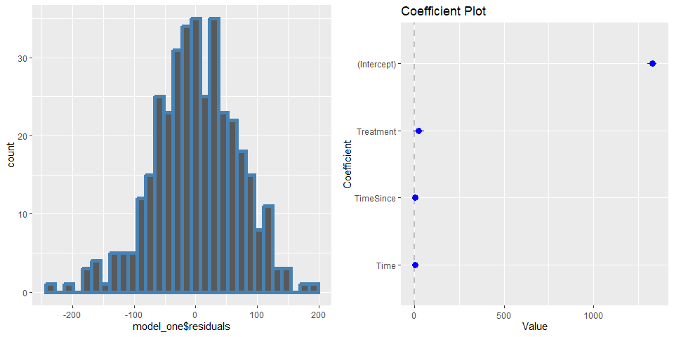
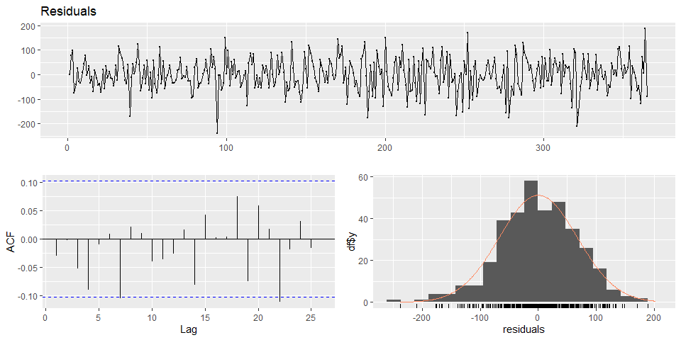
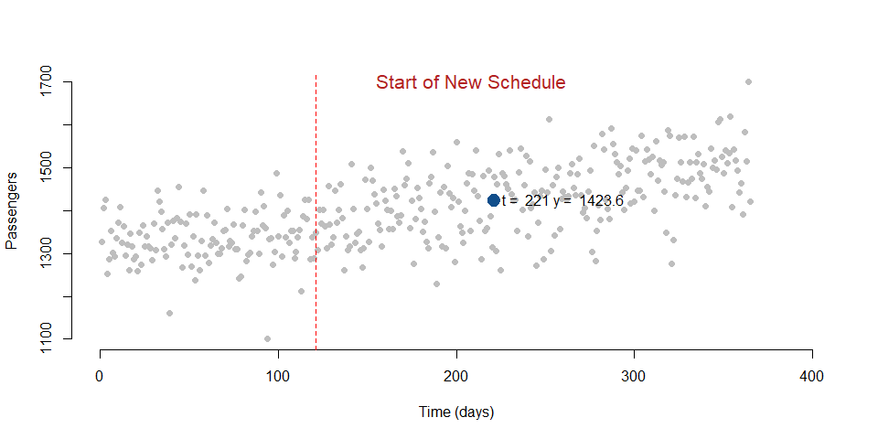
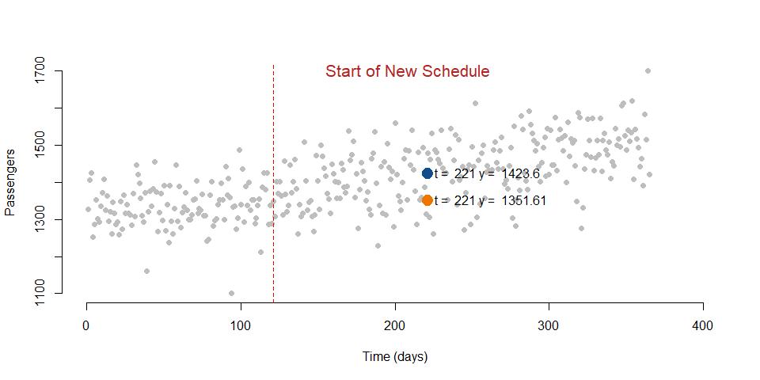
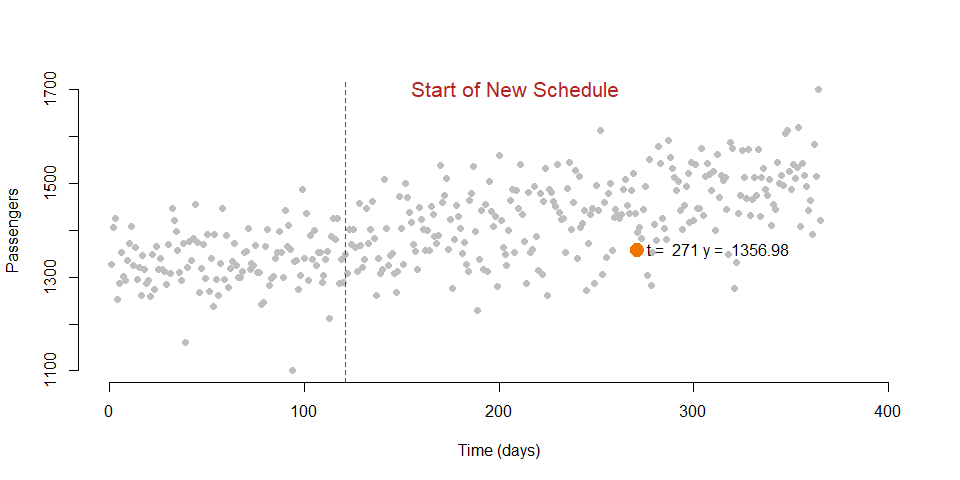
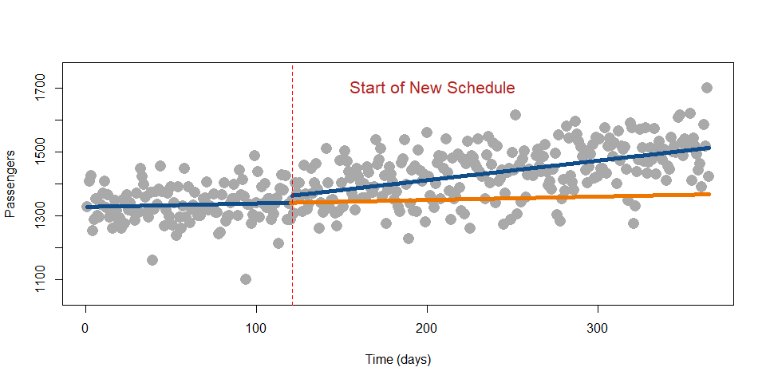
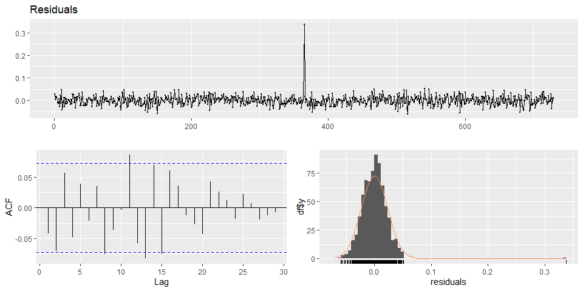

Interrupted Time Series LAB
================

# Instructions

There are **4 sets of questions** to be answered. You can earn up to 100
points + bonus questions. Points are indicated next to each question.

## The policy problem

> **RESEARCH QUESTION: Does an increase in bus frequency affect bus
> ridership in City A?**

Several cities aim to support public transportation and increase
ridership. There are several ways to encourage residents to utilize
public transportation more often; one of those is to modify the transit
schedule so as to increase the frequency of buses in peak times and
reduce waiting time.

City A has opted for this solution and starting from May 1st has
implemented a new bus schedule which increases bus frequency. At the end
of the year, the mayor wants to estimate whether the decision was
effective and ask you to analyze one year of ridership data to test the
following hypothesis:

> **HYPOTHESIS: An increase in bus frequency has a positive effect on
> bus ridership in City A (i.e., the new schedule is effective).**

## Data

Data on ridership were provided by the local transit agency. The
variable “Passengers” represents the number of daily passengers on all
buses in the city (in thousands). Data were collected from January 1st
to December 31st. The intervention was implemented on May 1st (day 121
is the first day of the new schedule).

| **Variable name** | **Description **                             |
|-------------------|----------------------------------------------|
| Passengers        | Daily passengers on the buses (in thousands) |

You can load the data by adding this chunk to your file:

Use a time series model to analyze the impact of the program.

# Lab Questions

## Question 1

**Q1: Prepare the data for the analysis.**

- **Q1a:** Create the three variables you will need to run a time series
  model: Time, TimeSince, and Treatment. Your dataset should look
  something like this: (5 points for each variable)

|         | passengers | Time | Treatment | TimeSince |
|:-------:|:----------:|:----:|:---------:|:---------:|
|  **1**  |    1328    |  1   |     0     |     0     |
|  **2**  |    1407    |  2   |     0     |     0     |
|  **3**  |    1425    |  3   |     0     |     0     |
|  **4**  |    1252    |  4   |     0     |     0     |
|  **5**  |    1287    |  5   |     0     |     0     |
|  **6**  |    1353    |  6   |     0     |     0     |
| **360** |    1463    | 360  |     1     |    240    |
| **361** |    1391    | 361  |     1     |    241    |
| **362** |    1583    | 362  |     1     |    242    |
| **363** |    1516    | 363  |     1     |    243    |
| **364** |    1700    | 364  |     1     |    244    |
| **365** |    1422    | 365  |     1     |    245    |

### Create Main Dataset

### **Answer:Q1a:**

``` r
main <-tibble(
passengers = passengers,
Time = 1:length(passengers),
Treatment = ifelse(Time >=  121,1,0),
TimeSince = c(rep(0,120),rep(1:245))
)
```

\*\* Output from the head and tail end of the data

``` r
head(main)%>%
  pander()
```

| passengers | Time | Treatment | TimeSince |
|:----------:|:----:|:---------:|:---------:|
|    1328    |  1   |     0     |     0     |
|    1407    |  2   |     0     |     0     |
|    1425    |  3   |     0     |     0     |
|    1252    |  4   |     0     |     0     |
|    1287    |  5   |     0     |     0     |
|    1353    |  6   |     0     |     0     |

``` r
tail(main)%>%
  pander()
```

| passengers | Time | Treatment | TimeSince |
|:----------:|:----:|:---------:|:---------:|
|    1463    | 360  |     1     |    240    |
|    1391    | 361  |     1     |    241    |
|    1583    | 362  |     1     |    242    |
|    1516    | 363  |     1     |    243    |
|    1700    | 364  |     1     |    244    |
|    1422    | 365  |     1     |    245    |

- **Q1b:** Provide a table of summary statistics of passenger traffic.
  (5 points)

### **Answer:Q1b:**

- Summary Statistics

``` r
summary(main)%>%
  pander()
```

|  passengers  |    Time     |   Treatment    |   TimeSince    |
|:------------:|:-----------:|:--------------:|:--------------:|
|  Min. :1100  |  Min. : 1   |  Min. :0.0000  |  Min. : 0.00   |
| 1st Qu.:1334 | 1st Qu.: 92 | 1st Qu.:0.0000 | 1st Qu.: 0.00  |
| Median :1401 | Median :183 | Median :1.0000 | Median : 63.00 |
|  Mean :1404  |  Mean :183  |  Mean :0.6712  |  Mean : 82.56  |
| 3rd Qu.:1469 | 3rd Qu.:274 | 3rd Qu.:1.0000 | 3rd Qu.:154.00 |
|  Max. :1700  |  Max. :365  |  Max. :1.0000  |  Max. :245.00  |

## Question 2

**Q2: Run the time series model.**

- Model

``` r
set.seed(1234)
model_one <- lm(passengers ~ .,data=main)


his<-main%>%
  ggplot(.,aes(x=model_one$residuals))+
  geom_histogram(bins = 30,colour = 'steelblue', size = 2)

coef<-coefplot::coefplot(model_one, sort = "magnitude")

grid.arrange(his,coef,ncol = 2)
```

<!-- -->

- **Q2a:** Run the model and provide a result table in stargazer. (5
  points + 5 points)

### **Answer:Q2a**

``` r
msummary(model_one, stars = c('*' = .1, '**' = .05, '***' = .01),
         vcov = sandwich::NeweyWest)
```

|             |     \(1\)      |
|:------------|:--------------:|
| (Intercept) | 1327.890\*\*\* |
|             |    (8.256)     |
| Time        |     0.107      |
|             |    (0.115)     |
| Treatment   |   21.682\*\*   |
|             |    (10.649)    |
| TimeSince   |  0.503\*\*\*   |
|             |    (0.126)     |
| Num.Obs.    |      365       |
| R2          |     0.444      |
| R2 Adj.     |     0.439      |
| AIC         |     4117.8     |
| BIC         |     4137.3     |
| Log.Lik.    |   -2053.904    |
| RMSE        |     67.24      |
| Std.Errors  |     Custom     |

**Note:** ^^ \* p \< 0.1, \*\* p \< 0.05, \*\*\* p \< 0.01

\`

``` r
library(forecast)

checkresiduals(model_one)
```

<!-- -->

    ## 
    ##  Breusch-Godfrey test for serial correlation of order up to 10
    ## 
    ## data:  Residuals
    ## LM test = 10.77, df = 10, p-value = 0.3757

We see that our residuals are not distinguishable from “White Noise”.

- **Q2b:** What does the intercept represent? (5 points)

### **Answer:Q2b**

The intercept represents the initial average of the passengers

- **Q2c:** What does the coefficient of Time represent? (5 points)

### **Answer:Q2c**

The Coefficient of Time represents the Slope before the Treatment or
intervention.

- **Q2d:** Which coefficient represents the immediate effect of the
  policy? (5 points)

### **Answer:Q2d**

The coefficient that represents the immediate effect is the
**Treatment** variable

- **Q2e:** Which coefficient represents the sustained effect of the
  policy? (5 points)

### **Answer:Q2e**

The coefficient **TimeSince** represents the sustained effect of the
model

## Question 3

**Q3: Now let’s look at the results more closely**

#### Plot of The New Schedule

``` r
plot( main$Time, main$passengers,
      bty="n", pch=19, col="gray",
      ylim = c(1100, 1700), xlim=c(0,400),
      xlab = "Time (days)", 
      ylab = "Passengers" )

# Line marking the interruption
abline( v=121, col="firebrick", lty=2 )
text( x = 150, y = 1700, "Start of New Schedule", col="firebrick", cex=1.3, pos=4 )

# Add the regression line
ts <- lm(passengers ~ ., data = main )
lines( main$Time, ts$fitted.values, col="steelblue", lwd=5)
```

<!-- -->

- **Q3a:** Has the new schedule increased or decreased the use of public
  transportation in the short term? Indicate the magnitude of the effect
  and whether it is statistically significant. (3 \* 3 points)

### **Answer: Q3a**

We see that there is both an immediate and Sustained Effect of the New
Schedule

- The Treatment contributes to a gain of \~ 22 Passengers along with the
  sustained effect of an additional gain of .5 Passengers for each day
  that passes.

- These coefficients are Statistically Significant

- Standard Errors used are **Newey-West**

- Given the immediate effect and Sustained effect of B2 and B3 From the
  New Schedule Plot, we can see in the short-term there is a positive
  gain in Public Transportation.

- **Q3b:** Has the new schedule increased or decreased the use of public
  transportation in the long term? Indicate the magnitude of the effect
  and whether it is statistically significant. (3 \* 3 points)

### **Answer: Q3b:**

As stated above, since we have an immediate effect and sustained
positive effect, which are both statistically significant. There is
strong evidence to support an increase in public transportation in the
long term due to the New Schedule.

However, since this is just to the end of the year. This analysis should
be revisited moving forward into the following year.

The reason to revisit this analysis is due to the limitations of ITS.

We may be observing a confounder that have failed to identify, and the
ITS may not be the appropriate model to use. Also, riders could possibly
return to the normal pre intervention trend (Regression to the mean).

- **Q3c:** Provide a brief (1-2 statements) possible explanation for
  these results. (4 points)

### Brief Summary:

This analysis shows that implementing a new schedule with an increase of
buses at peak times supports a strong increase in riders. This new
program shows immediate and sustained support for ridership increases.
Therefore, the New Schedule is effective.

## Question 4

**Q4:** An important aspect of a time series model is the
counterfactual.

- **Q4a:** What is the number of passengers 100 days after the
  intervention? (5 points)

``` r
p<-100
t<-121+p
treat<-1


# We create a small dataset with the new values
data1 <- as.data.frame( cbind( Time = t, Treatment = treat, TimeSince = p )) 


y1 <- predict( model_one, data1 ) 

# We plot our initial observations, the column Y in our dataset
plot( main$passengers,
      bty="n", pch=19, col="gray",
      ylim = c(1100, 1700), xlim=c(0,400),
      xlab = "Time (days)", 
      ylab = "Passengers" )


# We add a point showing the level of wellbeing at time = 201)
points( t, y1, col = "dodgerblue4", 
        pch = 19, bg = "dodgerblue4", cex = 2 )
text( t, y1, labels = paste("t = ",t,"y = ", round(y1,2)), pos = 4, cex = 1 )

text( x = 150, y = 1700, "Start of New Schedule", col="firebrick", cex=1.3, pos=4 )

# Line marking the interruption
abline( v=121, col="red", lty=2 )
```

<!-- -->

**Answer:Q4a:**

There are roughly 1424 Passengers total at 100 days post treatment.

- **Q4b:** What is the counterfactual? Provide both its formula and
  estimation. (5 + 5 points)

  **Answer: Q4b:**

$$\begin{equation} 
\text{Y} = \text{b}_0 + \text{b}_1*221 + \text{b}_2*0 + \text{b}_3*0 + \text{e}
\end{equation}$$

The counterfactual represents the group that received the treatment if
the treatment didn’t occur.

Basically, what would our passengers look like absent the new schedule,
and increased buses.

``` r
p2<-0
t2<-121+p2+100
treat2<-0


# We create a small dataset with the new values
data2 <- as.data.frame( cbind( Time = t2, Treatment = treat2, TimeSince = p2 )) 


y2 <- predict( model_one, data2 ) 

# We plot our initial observations, the column Y in our dataset
plot( main$passengers,
      bty="n", pch=19, col="gray",
      ylim = c(1100, 1700), xlim=c(0,400),
      xlab = "Time (days)", 
      ylab = "Passengers" )

points( t, y1, col = "dodgerblue4", 
        pch = 19, bg = "dodgerblue4", cex = 2 )

text( t, y1, labels = paste("t = ",t,"y = ", round(y1,2)), pos = 4, cex = 1 )

points( t2, y2, col = "darkorange2", 
        pch = 19, bg = "darkorange2", cex = 2 )
text( t2, y2, labels = paste("t = ",t2,"y = ", round(y2,2)), pos = 4, cex = 1 )

text( x = 150, y = 1700, "Start of New Schedule", col="firebrick", cex=1.3, pos=4 )

# Line marking the interruption
abline( v=121, col="red", lty=2 )
```

<!-- -->

**Answer:Q4c:**

Here we see the counterfactual as roughly 1352 passengers 100 days after
the intervention.

- **Q4c:** What would the counterfactual be after 150 days? (5 points)

``` r
p2<-0
t2<-150+p2+121
treat2<-0


# We create a small dataset with the new values
data2 <- as.data.frame( cbind( Time = t2, Treatment = treat2, TimeSince = p2 )) 


y2 <- predict( model_one, data2 ) 

# We plot our initial observations, the column Y in our dataset
plot( main$passengers,
      bty="n", pch=19, col="gray",
      ylim = c(1100, 1700), xlim=c(0,400),
      xlab = "Time (days)", 
      ylab = "Passengers" )


points( t2, y2, col = "darkorange2", 
        pch = 19, bg = "darkorange2", cex = 2 )
text( t2, y2, labels = paste("t = ",t2,"y = ", round(y2,2)), pos = 4, cex = 1 )

text( x = 150, y = 1700, "Start of New Schedule", col="firebrick", cex=1.3, pos=4 )

# Line marking the interruption
abline( v=121, col="red", lty=2 )
```

<!-- -->

Here we see the counterfactual as roughly 1357 passengers 150 days after
the intervention.

- **Q4d:** Are the two counterfactuals the same? Why? (3 + 5 points)

**Answer:Q4d**

The two counterfactuals are the same in that they represent the treated
group had the treatment not taken place. This trend will be show below.

``` r
pred1 <- predict(model_one, main) 

datanew <- as.data.frame(cbind(Time = rep(1 : 365), Treatment = rep(0), TimeSince = rep(0))) 

pred2 <- predict(model_one, datanew) 

plot(main$passengers,
    col = "darkgray",
    pch = 16,
    cex = 2,
    xlim = c(1, 365), 
    ylim = c(1050, 1750),
    xlab = "Time (days)", 
    ylab = "Passengers")

lines( rep(1:120), pred1[1:120], col="dodgerblue4", lwd = 5 )
lines( rep(121:365), pred1[121:365], col="dodgerblue4", lwd = 5 )
lines( rep(120:365), pred2[120:365], col="darkorange2", lwd = 5, lty = 7 ) 

text(0, 45, labels = "Predicted values", pos = 4, cex = 1, col = "dodgerblue3")
text(300, 105, labels = "Counterfactual", pos = 4, cex = 1, col = "darkorange2")

# Line marking the interruption
abline( v=121, col="red", lty=2 )

text( x = 150, y = 1700, "Start of New Schedule", col="firebrick", cex=1.3, pos=4 )
```

<!-- -->

## Bonus

**Time series with a control group**

We have learned that there are threats to the validity of time series
analysis. In particular, another event might have occurred at the same
time of the intervention and caused the immediate and sustained effect
that we observe.

A way to address this issue is to use a control group that is not
subject to the intervention. This design makes sure that the effect we
observe is the result of the policy intervention.

The mayor proposes to utilize city B as a control group. City B is a
neighbor city with very similar characteristics to city A. Yet city B
has not changed its bus schedule in the past year.

- **BQ1** Upload the data TS_Groups_Lab.csv from the class package. Look
  at the variables that are included and estimate a new time series
  model which includes the control group. (5 points)
- **BQ2** Interpret only the new coefficients in the model. Indicate
  whether they are stastitically significant and what they represent.
  Can you confirm the results of the previous model? (5 points)

``` r
URL <- "https://raw.githubusercontent.com/DS4PS/pe4ps-textbook/master/labs/DATA/TS_Groups_lab.csv"
dat.grouped <- read.csv( URL, stringsAsFactors=F )
```

|  X  | passengers | Time | Treatment | TimeSince | Group |
|:---:|:----------:|:----:|:---------:|:---------:|:-----:|
|  1  |    1175    |  1   |     0     |     0     |   1   |
|  2  |    1146    |  2   |     0     |     0     |   1   |
|  3  |    1164    |  3   |     0     |     0     |   1   |
|  4  |    1159    |  4   |     0     |     0     |   1   |
|  5  |    1133    |  5   |     0     |     0     |   1   |
|  6  |    1127    |  6   |     0     |     0     |   1   |

### Following the ITS Model with a Control Group

$$\begin{equation} 
\text{Y} = \text{b}_0 + \text{b}_1*T + \text{b}_2*D + \text{b}_3*P + \text{b}_4*G + \text{b}_5*G*T + \text{b}_6*G*D + \text{b}_7*G*P
  \tag{4.1}
\end{equation}$$

``` r
library(fable)
library(feasts)
library(dynlm)


options(scipen = 9999)

model_three<-lm(lag(log(passengers))~Group*Time+Group*Treatment+Group*TimeSince,
   data = dat.grouped)

out<-newey_west(model_three)

nw<-out[["extra_args"]][["lag"]][["residuals"]]

checkresiduals(nw)
```

<!-- -->

    ## 
    ##  Ljung-Box test
    ## 
    ## data:  Residuals
    ## Q* = 16.483, df = 10, p-value = 0.08662
    ## 
    ## Model df: 0.   Total lags used: 10

``` r
msummary(model_three, stars = c('*' = .1, '**' = .05, '***' = .01),
         vcov = sandwich::NeweyWest)
```

|                   |    \(1\)     |
|:------------------|:------------:|
| (Intercept)       | 7.078\*\*\*  |
|                   |   (0.012)    |
| Group             | -0.038\*\*\* |
|                   |   (0.013)    |
| Time              |    0.000     |
|                   |   (0.000)    |
| Treatment         |    0.001     |
|                   |   (0.007)    |
| TimeSince         |   0.000\*    |
|                   |   (0.000)    |
| Group × Time      | 0.001\*\*\*  |
|                   |   (0.000)    |
| Group × Treatment |    0.009     |
|                   |   (0.008)    |
| Group × TimeSince | 0.001\*\*\*  |
|                   |   (0.000)    |
| Num.Obs.          |     729      |
| R2                |    0.952     |
| R2 Adj.           |    0.951     |
| AIC               |    7047.0    |
| BIC               |    7088.3    |
| Log.Lik.          |   1702.828   |
| RMSE              |     0.02     |
| Std.Errors        |    Custom    |

**Note:** ^^ \* p \< 0.1, \*\* p \< 0.05, \*\*\* p \< 0.01

``` r
M <- model.matrix(lm(log(passengers)~Group*Time+Group*Treatment+Group*TimeSince+Time^2+
                  -X, data = dat.grouped))
Y <- as.matrix(dat.grouped$passengers)

(fit <- auto.arima(Y,
  xreg=M))
```

    ## Series: Y 
    ## Regression with ARIMA(0,0,0) errors 
    ## 
    ## Coefficients:
    ##       (Intercept)     Group    Time  Treatment  TimeSince  Group:Time
    ##          1171.879  -30.6334  0.1054    -5.7229     0.1453      0.4721
    ## s.e.        4.534    6.4120  0.0650     5.4822     0.0688      0.0920
    ##       Group:Treatment  Group:TimeSince
    ##                7.7485           1.1641
    ## s.e.           7.7529           0.0972
    ## 
    ## sigma^2 = 615.8:  log likelihood = -3376.16
    ## AIC=6770.32   AICc=6770.57   BIC=6811.66

ARIMA Model didn’t add any AR, MA, or difference

\###**Answer:BQ2**

G: From th initial model **model_three** we can see that Group is -.038
percent change from last month and statistically significant. The
control group shows a difference of -.038 from the Treatment group.
Passengers is lagged and logged to control for autocorrleation.

Passengers is last month and a percent change. So the control group on
the last month is different from the last month Treatment group with
statistical significance.

G\*T: Our coefficient for the interaction of Group and Time is .001 and
statistical significance. This represents the slop change difference
between the treatment and control group prior to the treatment.

G\*Treatment: Our coefficient for the interaction of Group and Treatment
is .009 and Not statistical significance. This represents the difference
between the Treatment and Control Group associated with the Treatment
Intervention.

G\*P: Our coefficient for the interaction of Group and TimeSince is .001
and statistical significance. This represents the slop change difference
between the treatment and control group regarding the sustained effect
of the treatment.

From the above, our analysis doesn’t show an immediate effect given the
treatment when adding a control group to the model. However, we do have
a positive and significant effect regarding the sustained treatment
effects post treatment.

**We can partially confirm the previous results of the initial model.**
