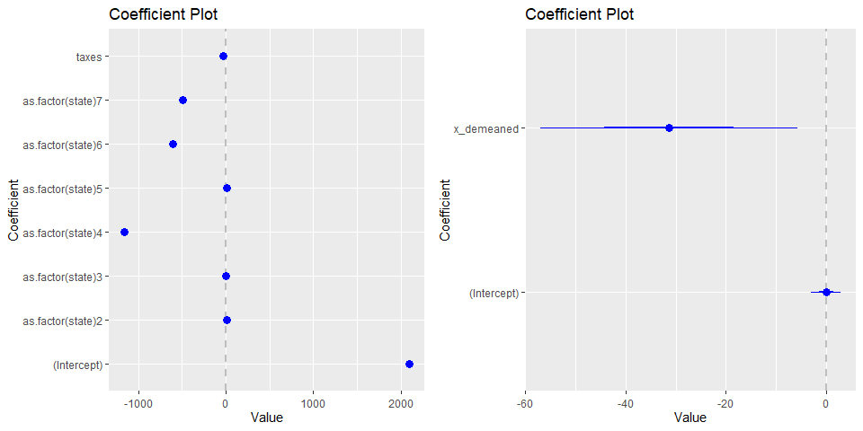

Fixed Effects Model LAB
================

For this lab you need to upload the FixEff_Lab data available in the
class R package.

There are **4 sets of questions** to be answered. You can get up to 100
points + bonus questions. Points are indicated next to each question.

Remember to:

- Format your table using stargazer
- Submit the r markdown file with all your codes.
- Bold your answers.

# The policy problem

> **Research question**: Do beer taxes affect car accidents at night
> time?

For this lab, we want to consider the effect of beer taxes on mortality
rates due to car accidents during night time. There has been several
studies examining how [state policies aiming to control alcohol
consumption affect car
accidents](https://www.sciencedirect.com/science/article/pii/S0167629696004900).
Beer taxes are a way for states to control consumption of alcohol;
higher beer taxes increase prices, which in turn decrease consumption.
Lower consumption of alcohol is expected to decrease drunk driving and
therefore accidents, especially at nigth time.

> **Hypothesis** Beer taxes will be negatively correlated with car
> accidents at night time.

# Data

We are going to use a set of simulated data that look at 7 southern US
states. For each state we have observations across 7 years.

The data are structured as a panel dataset. Variables are the following:

| **Variable name** | **Description **                                   |
|-------------------|----------------------------------------------------|
| state             | Each state is indicated with a number, from 1 to 7 |
| taxes             | Beer taxes as percentage of cost, from 0 to 1      |
| year              | Year in which observations were collected          |
| accidents         | Number of car accidents                            |

# Analysis

**Q1: Your colleague starts analyzing this data using a pooled OLS
model.**

- **Q1a:** Write the formula of a pooled regression model (5 points).

- **Answer:Q1a:**

$$\begin{equation} 
\text{Accidents}_{i,t} = \beta_0 + \beta_1*Taxes_{i,t} + \text{e}_{i,t}
\end{equation}$$  
  

- **Q1b:** Run a pooled OLS model and present your results in a table.
  (5 + 5 points)

- **Answer:Q1b:**

  

``` r
m1<-lm(accidents ~ taxes, data = data)


stargazer( m1, 
           type= "html", digits=3,
           intercept.bottom = FALSE,
           omit.stat = c("ser","f","rsq","adj.rsq") )
```

<table style="text-align:center">
<tr>
<td colspan="2" style="border-bottom: 1px solid black">
</td>
</tr>
<tr>
<td style="text-align:left">
</td>
<td>
<em>Dependent variable:</em>
</td>
</tr>
<tr>
<td>
</td>
<td colspan="1" style="border-bottom: 1px solid black">
</td>
</tr>
<tr>
<td style="text-align:left">
</td>
<td>
accidents
</td>
</tr>
<tr>
<td colspan="2" style="border-bottom: 1px solid black">
</td>
</tr>
<tr>
<td style="text-align:left">
Constant
</td>
<td>
1,359.741<sup>\*\*\*</sup>
</td>
</tr>
<tr>
<td style="text-align:left">
</td>
<td>
(262.700)
</td>
</tr>
<tr>
<td style="text-align:left">
</td>
<td>
</td>
</tr>
<tr>
<td style="text-align:left">
taxes
</td>
<td>
760.116
</td>
</tr>
<tr>
<td style="text-align:left">
</td>
<td>
(494.489)
</td>
</tr>
<tr>
<td style="text-align:left">
</td>
<td>
</td>
</tr>
<tr>
<td colspan="2" style="border-bottom: 1px solid black">
</td>
</tr>
<tr>
<td style="text-align:left">
Observations
</td>
<td>
49
</td>
</tr>
<tr>
<td colspan="2" style="border-bottom: 1px solid black">
</td>
</tr>
<tr>
<td style="text-align:left">
<em>Note:</em>
</td>
<td style="text-align:right">
<sup>*</sup>p\<0.1; <sup>**</sup>p\<0.05; <sup>***</sup>p\<0.01
</td>
</tr>
</table>

  
  

- **Q1c:** Do beer taxes have a significant effect on reducing car
  accidents? (5 points)

- **Answer: Q1c:**

Beer taxes have **no effect** on mortality rates in the given model.
Also, the direction of magnitude is positive. Taxes are shown to
increase mortality rates.

- **Q1d:** Interpret the coefficient of “taxes”. What is its effect on
  car accidents? Is the effect across or within states? (5 + 5 points)

- **Answer: Q1d:**

Beer taxes are shown to increase accidents by **~760** per year across
all states in the data. Again, this is not statistically different from
0.

**Q2: However, you know that grouped data might lead to biased results
because of the Simpson’s paradox (trends in the data are different when
data are looked at the group or aggregate level). You propose a fixed
effect model.**

- **Q2a:** Using an OLS approach, write the formula of the fixed effect
  model. (5 points)

- **Answer:Q2a:**

$$\begin{equation} 
\text{Accidents}_{i,t} = \alpha_{i} + \beta_1*Taxes_{i,t} + \text{e}_{i,t}
\end{equation}$$

  
Here we change out the intercept for i to show that each individual has
there own intercept.

The individual would be states

- **Q2b:** Looking at the formulas you wrote in response to Q1a and Q2a,
  what is the main difference between a pooled OLS and a fixed effect
  model? (5 points)

- **Answer:Q2b:**

The main difference between the OLS and the Fixed-Effect model is the
intercept. We are shifting from between variation to within variation.
Each individual (State) has there own intercept.

- **Q2c:** Now run two fixed-effect models, one including the intercept
  and one excluding the intercept (you can use the plm function for this
  latter). Present the results in a nice table. (5 + 5 + 5 points)

- **Answer:Q2c:**

``` r
m2<-lm( accidents ~ as.factor(state)+taxes, data=data ) 


m3<-plm( accidents ~ taxes, data=data, 
              index=c("state"), model="within" )

stargazer( m2, m3, 
           type = "html", 
           dep.var.labels = ("Accidents"),
           column.labels = c("FE", "Fixed-Effects w/o intercept"),
           digits = 2, intercept.bottom = FALSE )
```

<table style="text-align:center">
<tr>
<td colspan="3" style="border-bottom: 1px solid black">
</td>
</tr>
<tr>
<td style="text-align:left">
</td>
<td colspan="2">
<em>Dependent variable:</em>
</td>
</tr>
<tr>
<td>
</td>
<td colspan="2" style="border-bottom: 1px solid black">
</td>
</tr>
<tr>
<td style="text-align:left">
</td>
<td colspan="2">
Accidents
</td>
</tr>
<tr>
<td style="text-align:left">
</td>
<td>
<em>OLS</em>
</td>
<td>
<em>panel</em>
</td>
</tr>
<tr>
<td style="text-align:left">
</td>
<td>
<em></em>
</td>
<td>
<em>linear</em>
</td>
</tr>
<tr>
<td style="text-align:left">
</td>
<td>
FE
</td>
<td>
Fixed-Effects w/o intercept
</td>
</tr>
<tr>
<td style="text-align:left">
</td>
<td>
\(1\)
</td>
<td>
\(2\)
</td>
</tr>
<tr>
<td colspan="3" style="border-bottom: 1px solid black">
</td>
</tr>
<tr>
<td style="text-align:left">
Constant
</td>
<td>
2,090.57<sup>\*\*\*</sup>
</td>
<td>
</td>
</tr>
<tr>
<td style="text-align:left">
</td>
<td>
(8.64)
</td>
<td>
</td>
</tr>
<tr>
<td style="text-align:left">
</td>
<td>
</td>
<td>
</td>
</tr>
<tr>
<td style="text-align:left">
as.factor(state)2
</td>
<td>
6.42
</td>
<td>
</td>
</tr>
<tr>
<td style="text-align:left">
</td>
<td>
(5.94)
</td>
<td>
</td>
</tr>
<tr>
<td style="text-align:left">
</td>
<td>
</td>
<td>
</td>
</tr>
<tr>
<td style="text-align:left">
as.factor(state)3
</td>
<td>
-2.80
</td>
<td>
</td>
</tr>
<tr>
<td style="text-align:left">
</td>
<td>
(5.95)
</td>
<td>
</td>
</tr>
<tr>
<td style="text-align:left">
</td>
<td>
</td>
<td>
</td>
</tr>
<tr>
<td style="text-align:left">
as.factor(state)4
</td>
<td>
-1,159.82<sup>\*\*\*</sup>
</td>
<td>
</td>
</tr>
<tr>
<td style="text-align:left">
</td>
<td>
(6.05)
</td>
<td>
</td>
</tr>
<tr>
<td style="text-align:left">
</td>
<td>
</td>
<td>
</td>
</tr>
<tr>
<td style="text-align:left">
as.factor(state)5
</td>
<td>
9.66
</td>
<td>
</td>
</tr>
<tr>
<td style="text-align:left">
</td>
<td>
(5.94)
</td>
<td>
</td>
</tr>
<tr>
<td style="text-align:left">
</td>
<td>
</td>
<td>
</td>
</tr>
<tr>
<td style="text-align:left">
as.factor(state)6
</td>
<td>
-607.00<sup>\*\*\*</sup>
</td>
<td>
</td>
</tr>
<tr>
<td style="text-align:left">
</td>
<td>
(5.95)
</td>
<td>
</td>
</tr>
<tr>
<td style="text-align:left">
</td>
<td>
</td>
<td>
</td>
</tr>
<tr>
<td style="text-align:left">
as.factor(state)7
</td>
<td>
-495.99<sup>\*\*\*</sup>
</td>
<td>
</td>
</tr>
<tr>
<td style="text-align:left">
</td>
<td>
(6.06)
</td>
<td>
</td>
</tr>
<tr>
<td style="text-align:left">
</td>
<td>
</td>
<td>
</td>
</tr>
<tr>
<td style="text-align:left">
taxes
</td>
<td>
-31.37<sup>\*\*</sup>
</td>
<td>
-31.37<sup>\*\*</sup>
</td>
</tr>
<tr>
<td style="text-align:left">
</td>
<td>
(13.76)
</td>
<td>
(13.76)
</td>
</tr>
<tr>
<td style="text-align:left">
</td>
<td>
</td>
<td>
</td>
</tr>
<tr>
<td colspan="3" style="border-bottom: 1px solid black">
</td>
</tr>
<tr>
<td style="text-align:left">
Observations
</td>
<td>
49
</td>
<td>
49
</td>
</tr>
<tr>
<td style="text-align:left">
R<sup>2</sup>
</td>
<td>
1.00
</td>
<td>
0.11
</td>
</tr>
<tr>
<td style="text-align:left">
Adjusted R<sup>2</sup>
</td>
<td>
1.00
</td>
<td>
-0.04
</td>
</tr>
<tr>
<td style="text-align:left">
Residual Std. Error
</td>
<td>
11.11 (df = 41)
</td>
<td>
</td>
</tr>
<tr>
<td style="text-align:left">
F Statistic
</td>
<td>
9,975.24<sup>\*\*\*</sup> (df = 7; 41)
</td>
<td>
5.20<sup>\*\*</sup> (df = 1; 41)
</td>
</tr>
<tr>
<td colspan="3" style="border-bottom: 1px solid black">
</td>
</tr>
<tr>
<td style="text-align:left">
<em>Note:</em>
</td>
<td colspan="2" style="text-align:right">
<sup>*</sup>p\<0.1; <sup>**</sup>p\<0.05; <sup>***</sup>p\<0.01
</td>
</tr>
</table>

  
  
  
\* **Q2d:** When using a fixed effect model, do beer taxes have a
significant effect on reducing car accidents? (5 points)

- **Answer:Q2d:**

Applying fixed effects shows that Beer taxes decrease accidents with
statistical significance.

- **Q2e:** Describe the effect of “taxes” on car accidents. Make sure to
  specify whether the estimated effect is across or within states (5
  points).

- **Answer:Q2e:**

An increase in Beer Taxes, deceases accidents year to year **within**
the same state by **~-31**.

**Q3: We now have a look at state-level differences.**

- **Q3a:** What is the value of the intercept in the first model? What
  does the intercept represent in the first model? (5 points)

``` r
data%>%
  group_by(state)%>%
  summarise(avg = mean(accidents,na.rm=T))
```

    ## # A tibble: 7 × 2
    ##   state   avg
    ##   <int> <dbl>
    ## 1     1 2073.
    ## 2     2 2080.
    ## 3     3 2071.
    ## 4     4  916.
    ## 5     5 2083.
    ## 6     6 1467.
    ## 7     7 1580.

``` r
summary(lm(accidents~as.factor(state),data))%>%
  pander()
```

|                       | Estimate | Std. Error | t value | Pr(\>\|t\|) |
|:---------------------:|:--------:|:----------:|:-------:|:-----------:|
|    **(Intercept)**    |   2073   |   4.405    |  470.6  |  8.34e-80   |
| **as.factor(state)2** |  6.748   |    6.23    |  1.083  |   0.2849    |
| **as.factor(state)3** |  -1.868  |    6.23    | -0.2998 |   0.7658    |
| **as.factor(state)4** |  -1157   |    6.23    | -185.7  |  7.438e-63  |
| **as.factor(state)5** |  9.451   |    6.23    |  1.517  |   0.1367    |
| **as.factor(state)6** |  -606.4  |    6.23    | -97.34  |  4.251e-51  |
| **as.factor(state)7** |  -493.3  |    6.23    | -79.18  |  2.368e-47  |

| Observations | Residual Std. Error | $R^2$  | Adjusted $R^2$ |
|:------------:|:-------------------:|:------:|:--------------:|
|      49      |        11.66        | 0.9993 |     0.9992     |

Fitting linear model: accidents ~ as.factor(state)

  

- **Answer:Q3a:**

We can see from the outputs above that the constant from the first model
represents the average accident year to year **within** state 1 is
**~2,091** .

- **Q3b:** What is the value of the coefficient of “State4” in the first
  model? What does it say about the number of car accidents in state 4?
  (5 points)

- **Answer:Q3b:**

The coefficient on State 4 is the difference between State 4 and the
intercept State 1.

The number of car accidents comparing state4 to itself year to year is
**~931**

The coefficient is also statistically significant.

- **Q3c:** What is the value of the coefficient of “State4” in the
  second model? What does it say about the number of car accidents in
  state 4? (5 points)

- **Answer:Q3c:**

Create model 2 with lm function

``` r
m4<-lm( accidents ~ as.factor(state)+taxes-1, data=data ) 


stargazer( m2, m4, 
           type = "html", 
           dep.var.labels = ("Accidents"),
           column.labels = c("FE", "Fixed-Effects w/o intercept"),
           digits = 2, intercept.bottom = FALSE )
```

<table style="text-align:center">
<tr>
<td colspan="3" style="border-bottom: 1px solid black">
</td>
</tr>
<tr>
<td style="text-align:left">
</td>
<td colspan="2">
<em>Dependent variable:</em>
</td>
</tr>
<tr>
<td>
</td>
<td colspan="2" style="border-bottom: 1px solid black">
</td>
</tr>
<tr>
<td style="text-align:left">
</td>
<td colspan="2">
Accidents
</td>
</tr>
<tr>
<td style="text-align:left">
</td>
<td>
FE
</td>
<td>
Fixed-Effects w/o intercept
</td>
</tr>
<tr>
<td style="text-align:left">
</td>
<td>
\(1\)
</td>
<td>
\(2\)
</td>
</tr>
<tr>
<td colspan="3" style="border-bottom: 1px solid black">
</td>
</tr>
<tr>
<td style="text-align:left">
Constant
</td>
<td>
2,090.57<sup>\*\*\*</sup>
</td>
<td>
</td>
</tr>
<tr>
<td style="text-align:left">
</td>
<td>
(8.64)
</td>
<td>
</td>
</tr>
<tr>
<td style="text-align:left">
</td>
<td>
</td>
<td>
</td>
</tr>
<tr>
<td style="text-align:left">
as.factor(state)1
</td>
<td>
</td>
<td>
2,090.57<sup>\*\*\*</sup>
</td>
</tr>
<tr>
<td style="text-align:left">
</td>
<td>
</td>
<td>
(8.64)
</td>
</tr>
<tr>
<td style="text-align:left">
</td>
<td>
</td>
<td>
</td>
</tr>
<tr>
<td style="text-align:left">
as.factor(state)2
</td>
<td>
6.42
</td>
<td>
2,096.99<sup>\*\*\*</sup>
</td>
</tr>
<tr>
<td style="text-align:left">
</td>
<td>
(5.94)
</td>
<td>
(8.52)
</td>
</tr>
<tr>
<td style="text-align:left">
</td>
<td>
</td>
<td>
</td>
</tr>
<tr>
<td style="text-align:left">
as.factor(state)3
</td>
<td>
-2.80
</td>
<td>
2,087.77<sup>\*\*\*</sup>
</td>
</tr>
<tr>
<td style="text-align:left">
</td>
<td>
(5.95)
</td>
<td>
(8.29)
</td>
</tr>
<tr>
<td style="text-align:left">
</td>
<td>
</td>
<td>
</td>
</tr>
<tr>
<td style="text-align:left">
as.factor(state)4
</td>
<td>
-1,159.82<sup>\*\*\*</sup>
</td>
<td>
930.75<sup>\*\*\*</sup>
</td>
</tr>
<tr>
<td style="text-align:left">
</td>
<td>
(6.05)
</td>
<td>
(7.64)
</td>
</tr>
<tr>
<td style="text-align:left">
</td>
<td>
</td>
<td>
</td>
</tr>
<tr>
<td style="text-align:left">
as.factor(state)5
</td>
<td>
9.66
</td>
<td>
2,100.24<sup>\*\*\*</sup>
</td>
</tr>
<tr>
<td style="text-align:left">
</td>
<td>
(5.94)
</td>
<td>
(8.72)
</td>
</tr>
<tr>
<td style="text-align:left">
</td>
<td>
</td>
<td>
</td>
</tr>
<tr>
<td style="text-align:left">
as.factor(state)6
</td>
<td>
-607.00<sup>\*\*\*</sup>
</td>
<td>
1,483.57<sup>\*\*\*</sup>
</td>
</tr>
<tr>
<td style="text-align:left">
</td>
<td>
(5.95)
</td>
<td>
(8.42)
</td>
</tr>
<tr>
<td style="text-align:left">
</td>
<td>
</td>
<td>
</td>
</tr>
<tr>
<td style="text-align:left">
as.factor(state)7
</td>
<td>
-495.99<sup>\*\*\*</sup>
</td>
<td>
1,594.58<sup>\*\*\*</sup>
</td>
</tr>
<tr>
<td style="text-align:left">
</td>
<td>
(6.06)
</td>
<td>
(7.63)
</td>
</tr>
<tr>
<td style="text-align:left">
</td>
<td>
</td>
<td>
</td>
</tr>
<tr>
<td style="text-align:left">
taxes
</td>
<td>
-31.37<sup>\*\*</sup>
</td>
<td>
-31.37<sup>\*\*</sup>
</td>
</tr>
<tr>
<td style="text-align:left">
</td>
<td>
(13.76)
</td>
<td>
(13.76)
</td>
</tr>
<tr>
<td style="text-align:left">
</td>
<td>
</td>
<td>
</td>
</tr>
<tr>
<td colspan="3" style="border-bottom: 1px solid black">
</td>
</tr>
<tr>
<td style="text-align:left">
Observations
</td>
<td>
49
</td>
<td>
49
</td>
</tr>
<tr>
<td style="text-align:left">
R<sup>2</sup>
</td>
<td>
1.00
</td>
<td>
1.00
</td>
</tr>
<tr>
<td style="text-align:left">
Adjusted R<sup>2</sup>
</td>
<td>
1.00
</td>
<td>
1.00
</td>
</tr>
<tr>
<td style="text-align:left">
Residual Std. Error (df = 41)
</td>
<td>
11.11
</td>
<td>
11.11
</td>
</tr>
<tr>
<td style="text-align:left">
F Statistic
</td>
<td>
9,975.24<sup>\*\*\*</sup> (df = 7; 41)
</td>
<td>
161,136.40<sup>\*\*\*</sup> (df = 8; 41)
</td>
</tr>
<tr>
<td colspan="3" style="border-bottom: 1px solid black">
</td>
</tr>
<tr>
<td style="text-align:left">
<em>Note:</em>
</td>
<td colspan="2" style="text-align:right">
<sup>*</sup>p\<0.1; <sup>**</sup>p\<0.05; <sup>***</sup>p\<0.01
</td>
</tr>
</table>

  
  

We now get the correct average for State 4 since we excluded the
intercept from the model.

We get a statistical significant coefficient as **~931**

- **Q3d:** Why is the coefficient of “State3” non-significant in model 1
  while it is significant in model 2? (10 points)

- **Answer:Q3d:**

``` r
t.test(data$accidents[data$state==1],data$accidents[data$state==3])%>%
  pander()
```

| Test statistic |  df   | P value | Alternative hypothesis | mean of x | mean of y |
|:--------------:|:-----:|:-------:|:----------------------:|:---------:|:---------:|
|     0.3345     | 11.14 | 0.7442  |       two.sided        |   2073    |   2071    |

Welch Two Sample t-test: `data$accidents[data$state == 1]` and
`data$accidents[data$state == 3]`  
  

The coefficient for State 3 in model 1 is significant because we are
testing differences between accidents in State 3 compared to the
intercept in State 1. Model 2 removes the intercept. So when the policy
is 0, we are left with just the averages of within variation across time
for each state..

To demonstrate, we see that we fail to reject the Null Hypothesis of
difference in means between State 1 and State 3 for accidents. They are
in fact similar.

**Q4: Considering what you know about fixed effect models and the
current study, which of these variables would you suggest that your
colleague add in the model? Specify why.** (10 points)

- State geographical location (north, south, east… )
- Annual unemployment rates
- State form of government

**Answer:Q4**

- State geographical location (north, south, east… )

Including state geographical locations allows us to extract more
variation in regards to policies at the county level or from above…the
region level.

**BONUS QUESTION: We can run a fixed effect model by de-meaning our data
and then using an OLS predictor.**

- **BQ1:** De-mean the data (help yourself with the codes in the
  lecture)
- **BQ2:** Run a de-meaned OLS model and present results in a nice table
- **BQ3:** Do results change from the fixed effect model? Explain why.

``` r
new_df<-data%>%
  group_by(state)%>%
  mutate(x_demeaned = taxes - mean(taxes),
         y_demeaned = accidents - mean(accidents))%>%
  ungroup()


m5<-lm( y_demeaned~x_demeaned, data=new_df) 


stargazer( m2, m5, 
           type = "html", 
           dep.var.labels = ("Accidents"),
           column.labels = c("FE", "Fixed-Effects_de-meaned"),
           digits = 2, intercept.bottom = FALSE )
```

<table style="text-align:center">
<tr>
<td colspan="3" style="border-bottom: 1px solid black">
</td>
</tr>
<tr>
<td style="text-align:left">
</td>
<td colspan="2">
<em>Dependent variable:</em>
</td>
</tr>
<tr>
<td>
</td>
<td colspan="2" style="border-bottom: 1px solid black">
</td>
</tr>
<tr>
<td style="text-align:left">
</td>
<td>
Accidents
</td>
<td>
y_demeaned
</td>
</tr>
<tr>
<td style="text-align:left">
</td>
<td>
FE
</td>
<td>
Fixed-Effects
</td>
</tr>
<tr>
<td style="text-align:left">
</td>
<td>
\(1\)
</td>
<td>
\(2\)
</td>
</tr>
<tr>
<td colspan="3" style="border-bottom: 1px solid black">
</td>
</tr>
<tr>
<td style="text-align:left">
Constant
</td>
<td>
2,090.57<sup>\*\*\*</sup>
</td>
<td>
-0.00
</td>
</tr>
<tr>
<td style="text-align:left">
</td>
<td>
(8.64)
</td>
<td>
(1.48)
</td>
</tr>
<tr>
<td style="text-align:left">
</td>
<td>
</td>
<td>
</td>
</tr>
<tr>
<td style="text-align:left">
as.factor(state)2
</td>
<td>
6.42
</td>
<td>
</td>
</tr>
<tr>
<td style="text-align:left">
</td>
<td>
(5.94)
</td>
<td>
</td>
</tr>
<tr>
<td style="text-align:left">
</td>
<td>
</td>
<td>
</td>
</tr>
<tr>
<td style="text-align:left">
as.factor(state)3
</td>
<td>
-2.80
</td>
<td>
</td>
</tr>
<tr>
<td style="text-align:left">
</td>
<td>
(5.95)
</td>
<td>
</td>
</tr>
<tr>
<td style="text-align:left">
</td>
<td>
</td>
<td>
</td>
</tr>
<tr>
<td style="text-align:left">
as.factor(state)4
</td>
<td>
-1,159.82<sup>\*\*\*</sup>
</td>
<td>
</td>
</tr>
<tr>
<td style="text-align:left">
</td>
<td>
(6.05)
</td>
<td>
</td>
</tr>
<tr>
<td style="text-align:left">
</td>
<td>
</td>
<td>
</td>
</tr>
<tr>
<td style="text-align:left">
as.factor(state)5
</td>
<td>
9.66
</td>
<td>
</td>
</tr>
<tr>
<td style="text-align:left">
</td>
<td>
(5.94)
</td>
<td>
</td>
</tr>
<tr>
<td style="text-align:left">
</td>
<td>
</td>
<td>
</td>
</tr>
<tr>
<td style="text-align:left">
as.factor(state)6
</td>
<td>
-607.00<sup>\*\*\*</sup>
</td>
<td>
</td>
</tr>
<tr>
<td style="text-align:left">
</td>
<td>
(5.95)
</td>
<td>
</td>
</tr>
<tr>
<td style="text-align:left">
</td>
<td>
</td>
<td>
</td>
</tr>
<tr>
<td style="text-align:left">
as.factor(state)7
</td>
<td>
-495.99<sup>\*\*\*</sup>
</td>
<td>
</td>
</tr>
<tr>
<td style="text-align:left">
</td>
<td>
(6.06)
</td>
<td>
</td>
</tr>
<tr>
<td style="text-align:left">
</td>
<td>
</td>
<td>
</td>
</tr>
<tr>
<td style="text-align:left">
taxes
</td>
<td>
-31.37<sup>\*\*</sup>
</td>
<td>
</td>
</tr>
<tr>
<td style="text-align:left">
</td>
<td>
(13.76)
</td>
<td>
</td>
</tr>
<tr>
<td style="text-align:left">
</td>
<td>
</td>
<td>
</td>
</tr>
<tr>
<td style="text-align:left">
x_demeaned
</td>
<td>
</td>
<td>
-31.37<sup>\*\*</sup>
</td>
</tr>
<tr>
<td style="text-align:left">
</td>
<td>
</td>
<td>
(12.85)
</td>
</tr>
<tr>
<td style="text-align:left">
</td>
<td>
</td>
<td>
</td>
</tr>
<tr>
<td colspan="3" style="border-bottom: 1px solid black">
</td>
</tr>
<tr>
<td style="text-align:left">
Observations
</td>
<td>
49
</td>
<td>
49
</td>
</tr>
<tr>
<td style="text-align:left">
R<sup>2</sup>
</td>
<td>
1.00
</td>
<td>
0.11
</td>
</tr>
<tr>
<td style="text-align:left">
Adjusted R<sup>2</sup>
</td>
<td>
1.00
</td>
<td>
0.09
</td>
</tr>
<tr>
<td style="text-align:left">
Residual Std. Error
</td>
<td>
11.11 (df = 41)
</td>
<td>
10.38 (df = 47)
</td>
</tr>
<tr>
<td style="text-align:left">
F Statistic
</td>
<td>
9,975.24<sup>\*\*\*</sup> (df = 7; 41)
</td>
<td>
5.96<sup>\*\*</sup> (df = 1; 47)
</td>
</tr>
<tr>
<td colspan="3" style="border-bottom: 1px solid black">
</td>
</tr>
<tr>
<td style="text-align:left">
<em>Note:</em>
</td>
<td colspan="2" style="text-align:right">
<sup>*</sup>p\<0.1; <sup>**</sup>p\<0.05; <sup>***</sup>p\<0.01
</td>
</tr>
</table>

- **Answer: BQ3:**

The result of the main policy effect doesn’t change. We are left with
the **within** variation across the state and are able to see the same
effect with the original model. There may be differences in the results
regarding statistics such as R2, Adjust-R2 and standaed errors. However
this is due to the differences in models.

``` r
one<-coefplot::coefplot(m2)
two<-coefplot::coefplot(m5)


grid.arrange(one,two,ncol =2)
```

<!-- -->
